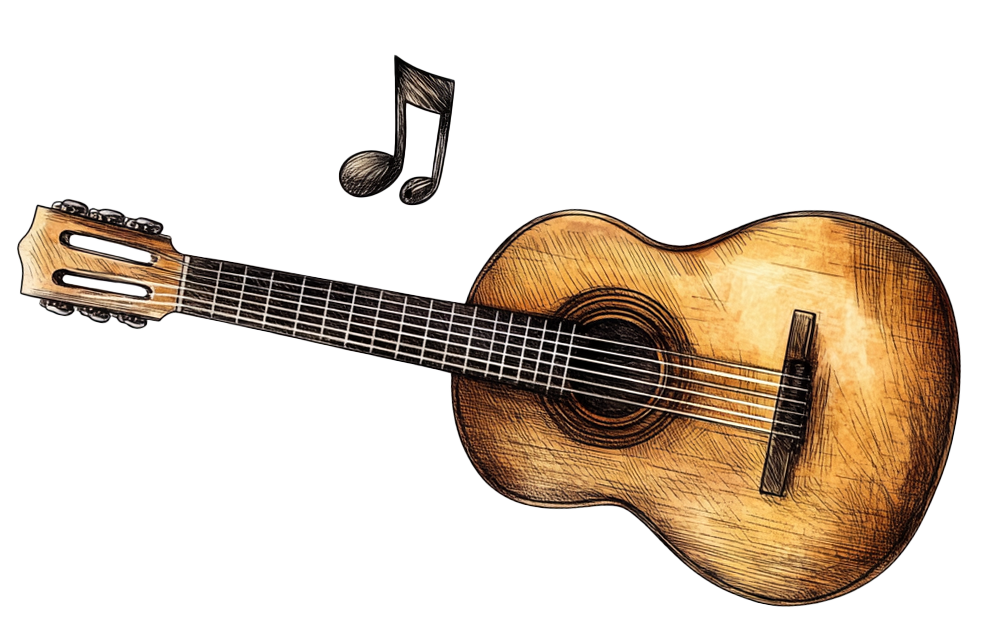

# Py Guitar Synthesizer

**py_guitar_synth** is a Python package for generating realistic guitar music from tab sheets by modeling the physical and musical characteristics of guitar strings and performance techniques. The project allows users to convert guitar tabs into audio, simulating strokes, note durations, transitions, and string properties.

<p align="center">
  
</p>

## Features

- Convert guitar tab sheets into realistic audio signals.
- Model various string characteristics such as _inharmonicity_, _decay rates_, and _vibrato_.
- Apply _impulse response convolution_ to simulate room acoustics.
- Add custom _echo effects_ to audio output.
- Support for multiple instruments (classical guitar, violin, piano).
- Built-in JSON-based configuration for instruments.
- Easily extendable for new instruments and custom sounds.

[Check out the documentation here](/docs/index.rst)

##  Play Samples

**Osad Eini**

- ['Osad Eini' with a classical guitar](/media/osad_eini_classical_guitar.mp3)
- ['Osad Eini' with a violin](/media/osad_eini_violin.mp3)

## Installation

You can clone this repository and install the package locally:

```bash
git clone https://github.com/MustafaAlotbah/PyGuitarSynthesis.git
cd PyGuitarSynthesis
pip install .
```

## Dependencies

- Python 3.9+
- `numpy`
- `soundfile`
- `sounddevice`

Ensure all dependencies are installed by running:

```bash
pip install -r requirements.txt
```

## Usage

### Example 1: Generating a Guitar Signal

You can use the following example to generate a guitar signal from a predefined sheet and instrument:

```python
from py_guitar_synth import default_classical_guitar, law_bass_f_aini, generate_guitar_signal_from_sheet

# Generate the signal
signal = generate_guitar_signal_from_sheet(
    instrument=default_classical_guitar,
    sheet=law_bass_f_aini,
    pluck_position=0.7,
    sr=44100
)

# Play or save the signal using your favorite audio library
import sounddevice as sd
sd.play(signal, 44100)
sd.wait()
```

### Example 2: Custom Instrument and Echo

```python
from py_guitar_synth import default_violine, agua_marina, generate_guitar_signal_from_sheet

# Generate signal with echo and impulse response
signal = generate_guitar_signal_from_sheet(
    instrument=default_violine,
    sheet=agua_marina,
    apply_convolution=True,
    apply_echo=True,
    echo_delay=0.25,
    echo_decay=0.3
)

# Save the signal to a WAV file
import soundfile as sf
sf.write('output.wav', signal, 44100)
```

### Loading Custom Instruments and Tabs

```python
from py_guitar_synth.instrument_parser import load_instrument_from_json
from py_guitar_synth.tab_parser import parse_guitar_tab_from_file
from py_guitar_synth import generate_guitar_signal_from_sheet

# Load custom instrument from a JSON file
my_instrument = load_instrument_from_json("path/to/my_instrument.json")

# Parse a guitar tab from a file
my_sheet = parse_guitar_tab_from_file("path/to/my_tab.txt")

# Generate the signal
signal = generate_guitar_signal_from_sheet(
    instrument=my_instrument,
    sheet=my_sheet
)
```

### Music Sheet Tab Format

`py_guitar_synth` supports a structured format for music sheets, which includes both metadata and the tab itself. 
The metadata section provides information about the piece, such as the title, author, tempo (in beats per minute), and any capo settings. 
The tab section follows, specifying the notes for each string in traditional guitar tab notation.

**Example**

```text
Title:  Agua Marina
Author: Paco Cepero
bpm:    90
capo fret: 2

# This is a comment

e |----3-2-3-2!3!2!-0++---| |----3-2-3-2!3!2!-0++-| |-0-2-0-2-0!2!0!------|
B |-0---------------------| |-0-------------------| |-----------------4++-|
G |-----------------------| |---------------------| |---------------------|
D |-----------------2+r---| |-----------------2+r-| |-----------------1+r-|
A |-----------------------| |---------------------| |---------------------|
E |-----------------------| |---------------------| |---------------------|
```

#### Metadata Section:

- **Title**: The title of the composition. In this example, it is _Agua Marina_.
- **Author**: The composer or arranger, here _Paco Cepero_, known for his contributions to flamenco music.
- **bpm (beats per minute)**: The tempo of the piece, which dictates the pacing of the performance. A tempo of `90 bpm` indicates a moderately slow pace, typical for expressive styles like ballads or slower flamenco pieces.
- **Capo Fret**: The fret position where the capo is placed. The capo at the second fret transposes all notes up by two semitones, effectively raising the pitch of the entire performance without altering the fingering patterns.

#### Tablature Section:

The tablature (or tab) notation directly corresponds to the guitar fretboard and specifies both pitch (fret number) and duration (note value) for each note.

- **Strings (e, B, G, D, A, E)**: These represent the six strings of the guitar, with `e` being the high e string (1st string) and `E` the low E string (6th string).
    
- **Fret Numbers**: The numbers indicate which fret to press on a given string. For example, `3` means pressing the 3rd fret.
    
- **Rhythmic Symbols**:
    
    - **`!`**: Marks shorter rhythmic values, such as eighth notes (`!`) or sixteenth notes (`!!`), providing finer rhythmic granularity.
    - **`++`**: Indicates longer note values like whole notes (`++`) or half notes (`+`), corresponding to sustained pitches that resonate longer.
    - **`r`**: The "let ring" indicator, meaning the note should continue to resonate after being plucked, producing a sustained tone.
- **Bars (`|----|`)**: The vertical bars divide the tab into readable measures but serve only as a visual guide. The width of each section between bars has no impact on timing or structure in the `py_guitar_synth` system, meaning the spacing is purely for organizational clarity. The actual note durations are encoded using symbols such as `!` or `++`.

## Command-Line Interface (CLI)

The `py_guitar_synth` package allows users to generate realistic guitar or other instrument sounds from a musical sheet, either predefined or from a file. 
The command-line interface (CLI) provides various options to customize the output, including instrument choice, sound effects, and more.

#### Usage

```shell
python -m py_guitar_synth [-h] [-i {classical_guitar,violin,piano}] [-s SHEET] [-p PLUCK_POSITION] [--sr SR] [--no-convolution] [--ir-file IR_FILE] [--no-echo] [--echo-delay ECHO_DELAY] [--echo-decay ECHO_DECAY]
```


```shell
python -m py_guitar_synth --instrument path/to/instrument.json --sheet path/to/tab.txt --output output.wav
```

#### CLI Options:

- **`-i {classical_guitar, violin, piano}` / `--instrument {classical_guitar, violin, piano}`**:  
    This flag allows you to specify the instrument for the synthesis. The tool supports three default instruments:
    
    - `classical_guitar`: The default instrument, which simulates the sound of a nylon-string classical guitar.
    - `violin`: A simulation of the violin, capturing the unique characteristics of string-based sound generation.
    - `piano`: Simulates piano keys, focusing on producing hammer-strike sounds instead of string plucks.
        
- **`-s SHEET` / `--sheet SHEET`**:  
    This option allows you to specify either a predefined sheet or the path to a custom tab file.
    
    - Predefined options include `law_bass_f_aini`, `agua_marina` and `osad_eini`, which are stored in the tool as examples.
    - If you prefer to use your custom music, provide the file path to a valid guitar tab sheet. The tool will parse the file and synthesize the corresponding sound.

- **`-p PLUCK_POSITION` / `--pluck_position PLUCK_POSITION`**:  
    The `pluck_position` parameter  represents the point along the length of the string where it is plucked, and it significantly influences the harmonic content of the sound produced.
    For instance, plucking near the bridge emphasizes higher harmonics, while plucking closer to the midpoint (e.g., 0.5) suppresses some harmonics.
    
    - The value is a floating point number between `0` and `1`, where `0` represents plucking near the bridge (brighter sound), and `1` represents plucking near the neck (mellower sound).
    - The default value is `0.7`, which corresponds to plucking closer to the middle of the string, providing a balanced sound.
- **`--sr SR` / `--sampling-rate SR`**:  
    This option controls the sample rate (`SR`) of the generated audio, in Hertz. The sample rate determines the audio quality and the size of the generated file.
    
    - The default value is `44100 Hz`, which is standard CD quality, but users can increase this for higher fidelity or reduce it for faster processing and smaller file sizes.
- **`--no-convolution`**:  
    By default, the tool applies an impulse response convolution to the audio, which simulates the acoustic properties of an environment (e.g., a guitar body, concert hall). This flag disables that effect, resulting in a raw, "dry" sound that has no added reverberation or acoustic characteristics.
    
- **`--ir-file IR_FILE`**:  
    This option allows you to provide a custom impulse response (IR) file in WAV format. An impulse response is a way to simulate how sound behaves in a specific acoustic space, like a room or inside an instrument's body.
    
    - If you have a custom impulse response, you can specify its path here to customize the acoustic environment applied to the sound synthesis. If this flag is not used, the default impulse response (if convolution is enabled) will be applied.
- **`--no-echo`**:  
    This flag disables the echo effect applied to the sound. The echo effect simulates a delay or reverberation, adding depth and realism to the generated sound.
    
    - Disabling this will result in a more direct, clean sound without any trailing reflections.
- **`--echo-delay ECHO_DELAY`**:  
    If echo is enabled (by default), this option allows you to set the delay time between the original sound and the first echo. The value represents time in seconds (e.g., `0.2` seconds by default).
    
    - A higher delay creates a more pronounced echo, simulating a larger room or a greater distance between reflective surfaces.
- **`--echo-decay ECHO_DECAY`**:  
    The `echo_decay` parameter controls how quickly the echo fades out after being heard. A value closer to `0` results in a faster fade, while higher values produce a longer-lasting echo. The default decay factor is `0.2`.
    
    - This gives control over how much reverb or echo is applied, allowing for subtle or more prominent effects, depending on the user’s preference.

Example usage:

```shell
guitar_synth --instrument py_guitar_synth/assets/classical_guitar.json --sheet py_guitar_synth/assets/law_bass.txt --output law_bass_output.wav
```


## Project Structure

```
py_guitar_synth/
├── assets/
│   ├── classical_guitar.json
│   ├── violine.json
│   ├── piano.json
│   ├── ir.wav
│   ├── agua_marina.txt
│   └── law_bass.txt
├── py_guitar_synth/
│   ├── instruments.py
│   ├── sheets.py
│   ├── signal_processing.py
│   └── types.py
└── tests/
```

## Development

To contribute to the project, clone the repository and install the dependencies for development:

```bash
git clone https://github.com/MustafaAlotbah/PyGuitarSynthesis.git
cd PyGuitarSynthesis
pip install -r requirements.txt
```

Feel free to submit issues or pull requests to help improve the package!

## Author

- **Mustafa Alotbah**
  - Email: mustafa.alotbah@gmail.com

## License

This project is licensed under the MIT License. See the [LICENSE](LICENSE) file for details.